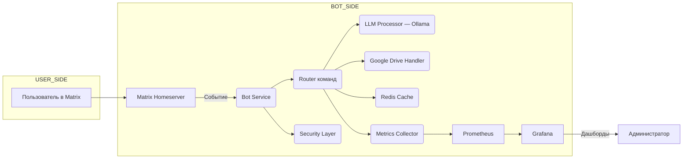

Хорошо, вот подробный `README.md` файл, оформленный для GitHub, на основе предоставленной документации. Он включает описание проекта, ключевых компонентов с техническими деталями, используемые технологии и инструменты, а также потенциал для расширения.

```markdown
# 🤖 Matrix AI Chatbot

[](LICENSE)
[](https://nodejs.org/)
[](https://www.docker.com/)
[](http://makeapullrequest.com)

Этот проект представляет собой продвинутого чат-бота для децентрализованной сети [Matrix](https://matrix.org/). Бот использует локально запущенную языковую модель (LLM) через [Ollama](https://ollama.ai/) для генерации ответов, может искать и обрабатывать документы из Google Drive, кэширует результаты для повышения производительности и собирает метрики для мониторинга. Основной упор сделан на конфиденциальность, модульность, надежность и масштабируемость.

---

## 📖 Оглавление

- [📖 Оглавление](#-оглавление)
- [🔍 Обзор проекта](#-обзор-проекта)
- [🗺️ Архитектура](#️-архитектура)
- [🧩 Ключевые компоненты](#-ключевые-компоненты)
  - [1. Matrix SDK и логика команд](#1-matrix-sdk-и-логика-команд)
  - [2. LLM через Ollama](#2-llm-через-ollama)
  - [3. Интеграция с Google Drive](#3-интеграция-с-google-drive)
  - [4. Кэширование в Redis](#4-кэширование-в-redis)
  - [5. Сбор и визуализация метрик](#5-сбор-и-визуализация-метрик)
  - [6. Контейнеризация и оркестрация](#6-контейнеризация-и-оркестрация)
  - [7. CI/CD и автоматизация](#7-cicd-и-автоматизация)
  - [8. Обеспечение безопасности](#8-обеспечение-безопасности)
  - [9. Локальная разработка и отладка](#9-локальная-разработка-и-отладка)
  - [10. Тестирование и качество кода](#10-тестирование-и-качество-кода)
- [⚙️ Технологический стек](#️-технологический-стек)
- [🚀 Потенциал масштабирования и расширения](#-потенциал-масштабирования-и-расширения)
- [📆 Роадмап развития проекта](#-роадмап-развития-проекта)
- [✍️ Рекомендации по документации и контрибьютингу](#️-рекомендации-по-документации-и-контрибьютингу)
- [🤝 Вклад в проект](#-вклад-в-проект)
- [📄 Лицензия](#-лицензия)

---

## 🔍 Обзор проекта

Проект **Matrix AI Chatbot** - это чат-бот, разработанный на **Node.js**, предназначенный для работы в экосистеме Matrix. Его основные функции:

*   **Генерация ответов:** Использует локально установленную языковую модель (LLM) через Ollama для создания контекстуальных ответов на запросы пользователей.
*   **Поиск и обработка документов:** Может выполнять поиск и извлекать содержимое документов (Google Docs, Sheets) из Google Drive.
*   **Кэширование:** Для повышения скорости отклика и снижения нагрузки на внешние сервисы (LLM, Google Drive) используются механизмы кэширования.
*   **Мониторинг:** Сбор и экспорт метрик производительности, использования кэша, ошибок и времени отклика для анализа и визуализации.
*   **Конфиденциальность:** Все данные обрабатываются локально, без передачи в сторонние облака.

**Ключевые принципы:**

*   **Конфиденциальность:** Все данные и запросы обрабатываются локально.
*   **Модульность:** Архитектура разделена на независимые модули с чёткими API.
*   **Масштабируемость:** Компоненты легко масштабируются (например, через Docker или Kubernetes).
*   **Надёжность:** Включает мониторинг, кэширование и продуманную обработку ошибок.

---

## 🗺️ Архитектура



**Компоненты:**

1.  **Bot Service (`src/bot.js`)**: Основной сервис, который инициализирует клиент Matrix, подписывается на события и управляет потоком данных.
2.  **Router команд (`src/router.js`)**: Анализирует входящие сообщения, определяет тип команды и направляет запрос соответствующему обработчику.
3.  **LLM Processor (`src/llm.js`)**: Модуль взаимодействия с Ollama. Отправляет запросы, получает ответы и может обрабатывать стриминг.
4.  **Google Drive Handler (`src/gdrive.js`)**: Модуль для поиска файлов по названию и извлечения их содержимого (Docs, Sheets).
5.  **Redis Cache (`src/cache.js`)**: Реализует кэширование результатов запросов к LLM и Google Drive.
6.  **Metrics Collector (`src/metrics.js`)**: Собирает внутренние метрики и предоставляет их по HTTP-эндпоинту для сбора Prometheus.
7.  **Security Layer (`src/security.js`)**: Проверяет права доступа (ACL), управляет токенами и может обрабатывать шифрование (E2E).
8.  **Prometheus**: Система мониторинга и сбора метрик.
9.  **Grafana**: Инструмент визуализации метрик, полученных из Prometheus.

---

## 🧩 Ключевые компоненты

### 1. Matrix SDK и логика команд

**Цель:** Обеспечить приём и отправку сообщений, поддержку команд и базовую обработку событий.

**Технические детали:**

*   **Библиотека:** `matrix-js-sdk@^18.0.0`
*   **Инициализация клиента:**
    ```javascript
    // src/bot.js
    import { createClient } from "matrix-js-sdk";

    const client = createClient({
      baseUrl: process.env.MATRIX_HOMESERVER_URL, // e.g., https://matrix.example.com
      accessToken: process.env.MATRIX_ACCESS_TOKEN, // Получается при создании пользователя бота
      userId: process.env.MATRIX_USER_ID, // @bot_user:example.com
    });

    client.startClient({ initialSyncLimit: 10 });
    ```
*   **Подписка на события:**
    ```javascript
    // src/bot.js
    client.on("Room.timeline", (event, room, toStartOfTimeline) => {
      if (event.getType() !== "m.room.message" || toStartOfTimeline || event.isRedacted()) {
        return;
      }
      // Предотвращение обработки собственных сообщений
      if (event.getSender() === client.getUserId()) {
        return;
      }
      handleMessage(event, room, client);
    });
    ```
*   **Парсинг команд:** Сообщения, начинающиеся с префикса `!`, интерпретируются как команды.
    *   Пример: `!ask Какова погода сегодня?`
    *   Используется простой парсинг, но в будущем можно внедрить более эффективные структуры данных (Trie/FSM) для O(1) разбора.
*   **Отправка сообщений:**
    ```javascript
    // src/utils.js
    export async function sendMessage(client, roomId, text) {
      try {
        await client.sendTextMessage(roomId, text);
      } catch (error) {
        console.error(`Ошибка отправки сообщения в комнату ${roomId}:`, error);
      }
    }
    ```

**Рекомендации:**

*   Реализовать дедупликацию сообщений по `event.getId()` для предотвращения двойной обработки.
*   Добавить rate-limiting и спам-фильтры на уровне обработчика команд.

---

### 2. LLM через Ollama

**Цель:** Использовать локально запущенную LLM для генерации ответов.

**Технические детали:**

*   **Ollama:** Сервер для запуска и взаимодействия с LLM. Запускается как отдельный сервис.
    *   Установка: `curl https://ollama.ai/install.sh | sh`
    *   Запуск модели: `ollama run llama3` (или `mistral`, `gemma`)
*   **API:** Ollama предоставляет REST API на `http://localhost:11434`.
*   **Модуль обёртки (`src/llm.js`):**
    ```javascript
    import axios from "axios";

    export async function generateLLM(prompt, opts = {}) {
      try {
        const response = await axios.post(`${process.env.OLLAMA_HOST}/api/generate`, {
          model: opts.model || "llama3",
          prompt,
          stream: opts.stream || false,
          options: {
            num_predict: opts.maxTokens || 512,
            temperature: opts.temperature || 0.7,
          },
        });
        return response.data.response; // Для не-стриминга
        // Для стриминга нужно обрабатывать поток данных
      } catch (error) {
        console.error("Ошибка при вызове LLM:", error.message);
        throw error;
      }
    }
    ```
*   **Предпрогрев (warm-up):** При запуске бота можно отправить тестовый запрос к модели, чтобы она была загружена в память.
*   **Стриминг:** Поддержка стриминга позволяет отправлять ответ пользователю по частям, уменьшая ощущаемую задержку.

**Оптимизации:**

*   Использовать более легковесные модели для быстрых, коротких ответов.
*   Автоматически выбирать модель в зависимости от длины запроса или типа задачи.
*   Для высоконагруженных сценариев можно использовать очереди задач (например, BullMQ) для обработки запросов к LLM в фоне.

---

### 3. Интеграция с Google Drive

**Цель:** Предоставить боту возможность искать и читать документы из Google Drive.

**Технические детали:**

*   **Библиотека:** `googleapis@^39.2.0`
*   **Настройка сервисного аккаунта:**
    1.  Создайте проект в [Google Cloud Console](https://console.cloud.google.com/).
    2.  Включите Google Drive API и Google Docs API.
    3.  Создайте сервисный аккаунт и загрузите JSON-ключ.
    4.  Поделитесь нужными папками/файлами Google Drive с email сервисного аккаунта.
*   **Инициализация аутентификации (`src/gdrive.js`):**
    ```javascript
    import { google } from "googleapis";
    import fs from "fs";

    const auth = new google.auth.GoogleAuth({
      keyFile: process.env.GOOGLE_CREDENTIALS_PATH, // Путь к JSON-файлу ключа
      scopes: [
        "https://www.googleapis.com/auth/drive.readonly",
        "https://www.googleapis.com/auth/documents.readonly",
        "https://www.googleapis.com/auth/spreadsheets.readonly"
      ],
    });

    const drive = google.drive({ version: "v3", auth });
    const docs = google.docs({ version: "v1", auth });
    const sheets = google.sheets({ version: "v4", auth });
    ```
*   **Поиск файла:**
    ```javascript
    // src/gdrive.js
    export async function findFile(query) {
      try {
        const res = await drive.files.list({
          q: `name contains '${query}' and mimeType != 'application/vnd.google-apps.folder'`,
          fields: "files(id, name, mimeType)",
          pageSize: 10,
        });
        return res.data.files;
      } catch (error) {
        console.error("Ошибка поиска файла в Google Drive:", error.message);
        throw error;
      }
    }
    ```
*   **Чтение содержимого:**
    ```javascript
    // src/gdrive.js
    export async function readDocumentContent(fileId, mimeType) {
      try {
        if (mimeType === "application/vnd.google-apps.document") {
          const doc = await docs.documents.get({ documentId: fileId });
          // Извлечение текста из структуры документа
          return doc.data.body.content.map(e => e.paragraph?.elements?.map(el => el.textRun?.content).join('')).join('');
        } else if (mimeType === "application/vnd.google-apps.spreadsheet") {
          const sheet = await sheets.spreadsheets.values.get({ spreadsheetId: fileId, range: "A1:Z1000" });
          // Преобразование в строку (простой пример)
          return sheet.data.values.map(row => row.join('\t')).join('\n');
        } else {
          throw new Error(`Неподдерживаемый тип файла: ${mimeType}`);
        }
      } catch (error) {
        console.error("Ошибка чтения содержимого файла:", error.message);
        throw error;
      }
    }
    ```

**Оптимизации:**

*   Кэшировать метаданные найденных файлов (ID, имя, MIME-тип) в Redis.
*   Использовать параметры `fields` и `q` для минимизации объема передаваемых данных.
*   При обработке нескольких файлов использовать batch-запросы или параллелизм.

---

### 4. Кэширование в Redis

**Цель:** Снизить нагрузку на LLM и Google Drive API, ускорить ответы на повторяющиеся запросы.

**Технические детали:**

*   **Библиотека:** `redis@^4.0.0`
*   **Подключение (`src/cache.js`):**
    ```javascript
    import { createClient } from "redis";

    let redisClient;

    export async function connectRedis() {
      redisClient = createClient({ url: process.env.REDIS_URL }); // redis://localhost:6379
      redisClient.on("error", (err) => console.error("Ошибка Redis:", err));
      await redisClient.connect();
      console.log("Подключение к Redis установлено.");
    }

    export function getRedisClient() {
      return redisClient;
    }
    ```
*   **Хранение и чтение (`src/cache.js`):**
    ```javascript
    import crypto from "crypto";

    function hashPrompt(prompt) {
      return crypto.createHash('md5').update(prompt).digest('hex');
    }

    export async function getCachedResponse(userId, prompt) {
      const key = `cache:${userId}:${hashPrompt(prompt)}`;
      const cached = await getRedisClient().get(key);
      return cached ? JSON.parse(cached) : null;
    }

    export async function setCachedResponse(userId, prompt, response, ttl = 3600) {
      const key = `cache:${userId}:${hashPrompt(prompt)}`;
      await getRedisClient().set(key, JSON.stringify(response), { EX: ttl });
    }
    ```
*   **Использование в основном обработчике:**
    ```javascript
    // src/router.js или аналогичном месте
    const cachedResponse = await getCachedResponse(userId, userPrompt);
    if (cachedResponse) {
        // Отправить кэшированный ответ
        metrics.incrementCacheHit();
        return cachedResponse;
    }
    // ... вызов LLM или Drive ...
    await setCachedResponse(userId, userPrompt, finalResponse);
    ```

**Продвинутые подходы:**

*   Настроить политику вытеснения (LRU) на уровне Redis (`maxmemory-policy allkeys-lru`).
*   Реализовать "теплый кэш" - предварительно загружать в кэш популярные или часто запрашиваемые данные.
*   Мониторить метрики `cache_hits_total` и `cache_misses_total` для анализа эффективности.

---

### 5. Сбор и визуализация метрик

**Цель:** Отслеживать производительность, ошибки и эффективность кэша.

**Технические детали:**

*   **Библиотека:** `prom-client@^13.0.0`
*   **Настройка (`src/metrics.js`):**
    ```javascript
    import client from 'prom-client';

    const register = new client.Registry();
    client.collectDefaultMetrics({ register });

    const requestCounter = new client.Counter({
      name: 'bot_requests_total',
      help: 'Количество запросов к боту',
      labelNames: ['command'],
    });

    const llmLatencyHistogram = new client.Histogram({
      name: 'llm_latency_seconds',
      help: 'Время обработки запроса LLM',
      buckets: [0.1, 0.5, 1, 2, 5, 10],
    });

    const driveErrorsCounter = new client.Counter({
      name: 'drive_errors_total',
      help: 'Количество ошибок при обращении к Google Drive',
    });

    const cacheHitsCounter = new client.Counter({
      name: 'cache_hits_total',
      help: 'Количество попаданий в кэш',
    });

    const cacheMissesCounter = new client.Counter({
      name: 'cache_misses_total',
      help: 'Количество промахов кэша',
    });

    register.registerMetric(requestCounter);
    register.registerMetric(llmLatencyHistogram);
    register.registerMetric(driveErrorsCounter);
    register.registerMetric(cacheHitsCounter);
    register.registerMetric(cacheMissesCounter);

    export { register, requestCounter, llmLatencyHistogram, driveErrorsCounter, cacheHitsCounter, cacheMissesCounter };
    ```
*   **Экспонирование метрик:**
    ```javascript
    // src/server.js (или отдельный файл для метрик)
    import express from 'express';
    import { register } from './metrics.js';

    const app = express();

    app.get('/metrics', async (req, res) => {
      try {
        res.set('Content-Type', register.contentType);
        res.end(await register.metrics());
      } catch (ex) {
        res.status(500).end(ex);
      }
    });

    app.listen(9090, '0.0.0.0', () => {
      console.log('Метрики доступны по адресу http://0.0.0.0:9090/metrics');
    });
    ```

**Визуализация:**

*   **Prometheus:** Система мониторинга, которая периодически скрейпит `/metrics`.
    *   Конфигурация (`prometheus.yml`):
        ```yaml
        scrape_configs:
          - job_name: 'matrix-bot'
            static_configs:
              - targets: ['bot:9090'] # Имя сервиса в docker-compose
        ```
*   **Grafana:** Инструмент визуализации, подключается к Prometheus как источнику данных.
    *   Создайте дашборды для отображения:
        *   Общее количество запросов (`bot_requests_total`)
        *   Среднее время отклика LLM (`rate(llm_latency_seconds_sum[5m]) / rate(llm_latency_seconds_count[5m])`)
        *   Количество ошибок Google Drive (`increase(drive_errors_total[5m])`)
        *   Процент попаданий в кэш (`rate(cache_hits_total[5m]) / (rate(cache_hits_total[5m]) + rate(cache_misses_total[5m]))`)

---

### 6. Контейнеризация и оркестрация

**Цель:** Обеспечить воспроизводимость среды разработки и упростить развертывание в production.

**Технические детали:**

*   **Dockerfile (`Dockerfile`):**
    ```dockerfile
    FROM node:20-alpine

    WORKDIR /app

    # Копируем package.json и package-lock.json (если есть) для кэширования зависимостей
    COPY package*.json ./

    # Устанавливаем зависимости
    RUN npm ci --only=production

    # Копируем исходный код
    COPY . .

    # Открываем порт для метрик (если используется)
    EXPOSE 9090

    # Команда запуска
    CMD ["node", "src/index.js"] # или другой главный файл
    ```
*   **docker-compose.yml (`docker-compose.yml`):**
    ```yaml
    version: "3.8"

    services:
      bot:
        build: .
        env_file:
          - .env
        depends_on:
          - redis
          - ollama # Если Ollama тоже в контейнере
        ports:
          - "9090:9090" # Для доступа к метрикам
        volumes:
          - ./credentials:/app/credentials # Монтируем папку с ключами Google

      redis:
        image: redis:7-alpine
        ports:
          - "6379:6379"

      ollama: # Опционально, если запускаете Ollama в контейнере
        image: ollama/ollama:latest
        ports:
          - "11434:11434"
        volumes:
          - ollama:/root/.ollama
        # Запуск модели при старте контейнера (опционально)
        command: ["/bin/sh", "-c", "ollama serve & sleep 5 && ollama run llama3 && wait"]

      prometheus:
        image: prom/prometheus
        ports:
          - "9091:9090" # Prometheus UI
        volumes:
          - ./prometheus.yml:/etc/prometheus/prometheus.yml
          - prometheus_data:/prometheus
        command:
          - '--config.file=/etc/prometheus/prometheus.yml'
          - '--storage.tsdb.path=/prometheus'
          - '--web.console.libraries=/etc/prometheus/console_libraries'
          - '--web.console.templates=/etc/prometheus/consoles'
          - '--storage.tsdb.retention.time=200h'
          - '--web.enable-lifecycle'

      grafana:
        image: grafana/grafana-oss
        ports:
          - "3000:3000"
        volumes:
          - grafana_data:/var/lib/grafana
        depends_on:
          - prometheus
        environment:
          - GF_SECURITY_ADMIN_PASSWORD=admin # Установите свой пароль

    volumes:
      ollama:
      prometheus_data:
      grafana_data:
    ```

**Продвинутые:**

*   Создать **Helm-чарты** для развертывания в **Kubernetes**.
*   Настроить **авто-масштабирование** (HPA) для подов бота в зависимости от нагрузки.
*   Использовать **sidecar-контейнеры** (например, Fluentd/Fluent-bit) для централизованного сбора логов.

---

### 7. CI/CD и автоматизация

**Цель:** Автоматизировать процессы тестирования, сборки и развертывания.

**Технические детали:**

*   **GitHub Actions (`.github/workflows/ci.yml`):**
    ```yaml
    name: CI/CD Pipeline

    on:
      push:
        branches: [ main ]
      pull_request:
        branches: [ main ]

    jobs:
      build-and-test:
        runs-on: ubuntu-latest

        steps:
        - uses: actions/checkout@v3

        - name: Setup Node.js
          uses: actions/setup-node@v3
          with:
            node-version: '20'
            cache: 'npm'

        - name: Install dependencies
          run: npm ci

        - name: Run linter
          run: npm run lint

        - name: Run tests
          run: npm run test

      build-and-publish:
        needs: build-and-test
        if: github.ref == 'refs/heads/main' # Только для main ветки
        runs-on: ubuntu-latest

        steps:
        - uses: actions/checkout@v3

        - name: Set up Docker Buildx
          uses: docker/setup-buildx-action@v2

        - name: Login to DockerHub
          uses: docker/login-action@v2
          with:
            username: ${{ secrets.DOCKER_USERNAME }}
            password: ${{ secrets.DOCKER_PASSWORD }}

        - name: Extract metadata (tags, labels) for Docker
          id: meta
          uses: docker/metadata-action@v4
          with:
            images: myorg/matrix-ai-chatbot

        - name: Build and push Docker image
          uses: docker/build-push-action@v4
          with:
            context: .
            push: true
            tags: ${{ steps.meta.outputs.tags }}
            labels: ${{ steps.meta.outputs.labels }}
    ```
*   **Автоматизация:**
    *   Использовать `dependabot` для автоматического создания PR с обновлениями зависимостей.
    *   Включить автоматические сканеры безопасности (например, Snyk, Dependabot Security Alerts).
    *   Настроить автоматический **rollback** при неудачном развертывании.

---

### 8. Обеспечение безопасности

**Цель:** Защитить данные пользователей и инфраструктуру.

**Практики:**

*   **E2E-шифрование:** Использовать возможности `matrix-js-sdk` для работы с зашифрованными комнатами (требует настройки меголистов).
*   **ACL (Access Control List):** Ограничивать доступ к командам бота на уровне комнат или пользователей.
*   **Управление секретами:**
    *   Хранить чувствительные данные (токены, ключи) в `.env` файле.
    *   В production использовать **Vault** или **GitHub Secrets**.
    *   Никогда не коммитить `.env` в репозиторий.
*   **Rate-limiting:** Ограничивать количество запросов от одного пользователя за определенный промежуток времени.
*   **Валидация входных данных:** Санитизировать и проверять все входящие сообщения и команды на предмет вредоносного кода или слишком длинных запросов.
*   **2FA для Google:** Включить двухфакторную аутентификацию для сервисного аккаунта Google (опционально, но рекомендуется).

---

### 9. Локальная разработка и отладка

**Цель:** Упростить процесс разработки и тестирования.

**Инструменты:**

*   **dotenv:** Используется для загрузки переменных окружения из файла `.env`.
*   **nodemon:** Автоматически перезапускает Node.js приложение при изменении файлов.
    *   Установка: `npm install -g nodemon`
    *   Запуск: `nodemon src/index.js`
*   **Mock-сервисы:**
    *   Использовать `msw` (Mock Service Worker) или создать простой Express-сервер для эмуляции Ollama API.
    *   Использовать `WireMock` или написать собственные моки для Google Drive API для тестирования без реальных вызовов.
*   **VS Code:**
    *   Настроить `launch.json` для запуска и отладки приложения прямо в редакторе.
    *   Использовать расширения: ESLint, Prettier, Debugger for Chrome/Node.js.

---

### 10. Тестирование и качество кода

**Цель:** Гарантировать корректную работу, предотвращать регрессии и поддерживать высокое качество кода.

**Подходы:**

*   **Unit-тесты:** Использовать **Jest** или **Mocha** с библиотекой **Sinon** для создания моков.
    *   Пример unit-теста (`tests/llm.test.js`):
        ```javascript
        import { generateLLM } from '../src/llm';
        import axios from 'axios';
        import MockAdapter from 'axios-mock-adapter';

        const mock = new MockAdapter(axios);

        describe('LLM Module', () => {
          afterEach(() => {
            mock.reset();
          });

          it('should return generated text', async () => {
            const mockResponse = { response: 'Привет, мир!' };
            mock.onPost(`${process.env.OLLAMA_HOST}/api/generate`).reply(200, mockResponse);

            const result = await generateLLM('Say hello');
            expect(result).toBe('Привет, мир!');
          });

          it('should handle API errors', async () => {
            mock.onPost(`${process.env.OLLAMA_HOST}/api/generate`).networkError();

            await expect(generateLLM('Error test')).rejects.toThrow('Network Error');
          });
        });
        ```
*   **Integration-tests:** Запускать тесты с реальными сервисами (Redis, Ollama, Google API с тестовыми учётными данными).
*   **Contract-tests:** Проверять, что API компонентов соответствуют заранее определённым контрактам.
*   **Static Analysis:**
    *   **ESLint:** Для проверки синтаксиса и стиля кода.
    *   **Prettier:** Для автоматического форматирования кода.
    *   **TypeScript:** (Опционально) Для статической типизации (если проект будет переписан или расширен с использованием TS).
*   **Coverage:** Использовать **Istanbul** (встроенный в Jest) для измерения покрытия кода тестами. Отчёт можно генерировать на CI.

---

## ⚙️ Технологический стек

| Категория             | Инструменты / Библиотеки                          | Назначение                                                                 |
|-----------------------|---------------------------------------------------|----------------------------------------------------------------------------|
| Язык                  | Node.js 20, ECMAScript Modules (ESM)              | Основная платформа                                                         |
| Matrix SDK            | `matrix-js-sdk`                                   | Работа с Matrix-homeserver (сообщения, события, E2E)                       |
| LLM                   | Ollama (llama3, mistral, gemma)                   | Приватная языковая модель для генерации ответов                            |
| Google API            | `googleapis`                                      | Доступ к Google Drive, Docs, Sheets                                        |
| Кэширование           | Redis, `redis` (Node.js клиент)                   | Ускорение повторных запросов                                               |
| Очереди задач         | BullMQ, Redis Streams                             | Построение фоновых задач (опционально для масштабирования)                 |
| Мониторинг            | `prom-client`, Prometheus, Grafana                | Метрики и дашборды                                                         |
| Контейнеры            | Docker, Docker Compose, Kubernetes (для prod)     | Изоляция, масштабирование, управление зависимостями                        |
| CI/CD                 | GitHub Actions                                    | Автотестирование, сборка и деплой                                          |
| Безопасность          | Dotenv, Vault, HTTPS, E2E шифрование               | Управление секретами, защита данных, безопасная передача                   |
| Локальная разработка  | nodemon, msw, WireMock                            | Быстрый цикл разработки и эмуляция внешних сервисов                        |
| Тестирование          | Jest, Sinon, axios-mock-adapter, Supertest        | Unit, Integration, Contract tests                                          |
| Анализ кода           | ESLint, Prettier                                  | Static analysis, форматирование                                            |
| Документация          | Markdown, Mermaid, Swagger/OpenAPI (опционально)  | Описание архитектуры, диаграммы, спецификации API                          |

---

## 🚀 Потенциал масштабирования и расширения

Проект легко расширить благодаря модульной архитектуре:

1.  **Семантический поиск:**
    *   Интегрировать векторную базу данных (например, Pinecone, Weaviate, Qdrant).
    *   Генерировать embeddings для документов из Google Drive и запросов пользователей.
    *   Использовать их для более точного поиска релевантной информации.
2.  **Плагины:**
    *   Разработать систему подключаемых модулей для новых API-интеграций (например, Jira, Confluence, базы данных).
3.  **Голосовые интерфейсы:**
    *   Добавить ASR (Speech-to-Text) для преобразования голоса в текст.
    *   Добавить TTS (Text-to-Speech) для озвучивания ответов бота.
4.  **Многоязычие:**
    *   Выбрать библиотеку i18n (например, `i18next`).
    *   Перевести команды и интерфейс бота.
    *   Настроить LLM для работы с несколькими языками.
5.  **Autoscaling:**
    *   Настроить Horizontal Pod Autoscaler (HPA) в Kubernetes для пула воркеров бота и Ollama.
6.  **Serverless-функции:**
    *   Вынести часть логики (например, сложный анализ текста, обработка изображений) в AWS Lambda, GCP Functions или аналогичные сервисы.

---

## 📆 Роадмап развития проекта

| Этап                  | Функционал                                                                 | Приоритет   |
|-----------------------|---------------------------------------------------------------------------|-------------|
| MVP                   | CLI-бот, базовая обработка команд `!ask`, `!find`, LLM, Google Drive      | Высокий     |
| Мониторинг            | Prometheus, Grafana, базовый дашборд                                       | Средний     |
| CI/CD, Docker         | GitHub Actions + Docker Compose, докеризация всех сервисов                | Высокий     |
| Расширяемость         | Plugins API, интеграция vector search                                      | Низкий–средний |
| Безопасность          | Vault, 2FA для Google, аудит логов                                         | Средний     |
| UI-панель             | Веб-интерфейс для управления, конфигурирования и просмотра логов           | Низкий      |

---

## ✍️ Рекомендации по документации и контрибьютингу

*   **Архитектура:** Подробно описывать архитектуру в Wiki репозитория, использовать диаграммы Mermaid.
*   **PR-шаблоны:** Создать шаблоны Pull Request, где автор указывает, что было добавлено/изменено, какие тесты написаны, какие изменения в документации.
*   **Semantic Commit Messages:** Использовать семантические сообщения коммитов (`feat:`, `fix:`, `docs:`) для автоматической генерации CHANGELOG.
*   **Уровни релизов:** Следовать принципам SemVer (Semantic Versioning) и создавать релизы на GitHub.
*   **Кодстайл:** Настроить ESLint и Prettier. Использовать `husky` и `lint-staged` для запуска линтера и форматирования при коммите.

---

## 🤝 Вклад в проект

Вклады приветствуются! Пожалуйста, ознакомьтесь с [CONTRIBUTING.md](CONTRIBUTING.md) (его нужно будет создать) для получения информации о процессе разработки и наших стандартах кода.

---

## 📄 Лицензия

Этот проект лицензирован по лицензии MIT - подробности см. в файле [LICENSE](LICENSE).

---

Создано с ❤️ для сообщества Matrix и энтузиастов приватного ИИ.
```

Этот `README.md` файл предоставляет исчерпывающее руководство по проекту. Он охватывает все основные аспекты, технологии и потенциальные направления развития, что должно помочь вам или любой другой команде успешно создать, запустить и расширить Matrix AI Chatbot.
