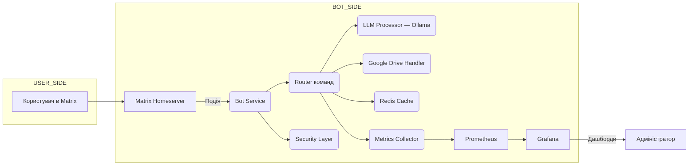

```markdown
# 🤖 Matrix AI Chatbot

[](LICENSE)
[](https://nodejs.org/)
[](https://www.docker.com/)
[](http://makeapullrequest.com)
[](https://t.me/Dmitry_Shiva)

Цей проект представляє собою просунутого чат-бота для децентралізованої мережі [Matrix](https://matrix.org/). Бот використовує локально запущену мовну модель (LLM) через [Ollama](https://ollama.ai/) для генерації відповідей, може шукати та обробляти документи з Google Drive, кешує результати для підвищення продуктивності та збирає метрики для моніторингу. Основний акцент зроблено на конфіденційність, модульність, надійність та масштабованість.

## 👨‍💻 Автор

**Дмитро Шивачов** - [@Dmitry_Shiva](https://t.me/Dmitry_Shiva)

Цей проект створено з ❤️ для спільноти Matrix та ентузіастів приватного штучного інтелекту.

---

## 📖 Зміст

- [📖 Зміст](#-зміст)
- [👨‍💻 Автор](#-автор)
- [🔍 Огляд проекту](#-огляд-проекту)
- [🗺️ Архітектура](#️-архітектура)
- [🧩 Ключові компоненти](#-ключові-компоненти)
  - [1. Matrix SDK та логіка команд](#1-matrix-sdk-та-логіка-команд)
  - [2. LLM через Ollama](#2-llm-через-ollama)
  - [3. Інтеграція з Google Drive](#3-інтеграція-з-google-drive)
  - [4. Кешування в Redis](#4-кешування-в-redis)
  - [5. Збір та візуалізація метрик](#5-збір-та-візуалізація-метрик)
  - [6. Контейнеризація та оркестрація](#6-контейнеризація-та-оркестрація)
  - [7. CI/CD та автоматизація](#7-cicd-та-автоматизація)
  - [8. Забезпечення безпеки](#8-забезпечення-безпеки)
  - [9. Локальна розробка та відладка](#9-локальна-розробка-та-відладка)
  - [10. Тестування та якість коду](#10-тестування-та-якість-коду)
- [⚙️ Технологічний стек](#️-технологічний-стек)
- [🔧 Підключення та налаштування сервісів](#-підключення-та-налаштування-сервісів)
  - [📋 Передумови](#-передумови)
  - [🚀 Швидкий старт](#-швидкий-старт)
  - [🔧 Детальне налаштування](#-детальне-налаштування)
  - [🐳 Docker налаштування](#-docker-налаштування)
  - [📊 Моніторинг та метрики](#-моніторинг-та-метрики)
  - [🔍 Діагностика проблем](#-діагностика-проблем)
- [📁 Структура проекту та опис файлів](#-структура-проекту-та-опис-файлів)
  - [🗂️ Основна структура](#️-основна-структура)
  - [📄 Детальний опис файлів](#-детальний-опис-файлів)
- [🚀 Потенціал масштабування та розширення](#-потенціал-масштабування-та-розширення)
- [📆 Роадмап розвитку проекту](#-роадмап-розвитку-проекту)
- [✍️ Рекомендації щодо документації та контрибьютингу](#️-рекомендації-щодо-документації-та-контрибьютингу)
- [🤝 Внесок у проект](#-внесок-у-проект)
- [📄 Ліцензія](#-ліцензія)

---

## 🔍 Огляд проекту

Проект **Matrix AI Chatbot** - це чат-бот, розроблений на **Node.js**, призначений для роботи в екосистемі Matrix. Його основні функції:

*   **Генерація відповідей:** Використовує локально встановлену мовну модель (LLM) через Ollama для створення контекстуальних відповідей на запити користувачів.
*   **Пошук та обробка документів:** Може виконувати пошук та витягувати вміст документів (Google Docs, Sheets) з Google Drive.
*   **Кешування:** Для підвищення швидкості відгуку та зниження навантаження на зовнішні сервіси (LLM, Google Drive) використовуються механізми кешування.
*   **Моніторинг:** Збір та експорт метрик продуктивності, використання кешу, помилок та часу відгуку для аналізу та візуалізації.
*   **Конфіденційність:** Всі дані обробляються локально, без передачі в сторонні хмари.

**Ключові принципи:**

*   **Конфіденційність:** Всі дані та запити обробляються локально.
*   **Модульність:** Архітектура розділена на незалежні модулі з чіткими API.
*   **Масштабованість:** Компоненти легко масштабуються (наприклад, через Docker або Kubernetes).
*   **Надійність:** Включає моніторинг, кешування та продуману обробку помилок.

---

## 🗺️ Архітектура



**Компоненти:**

1.  **Bot Service (`src/bot.js`)**: Основний сервіс, який ініціалізує клієнт Matrix, підписується на події та керує потоком даних.
2.  **Router команд (`src/router.js`)**: Аналізує вхідні повідомлення, визначає тип команди та направляє запит відповідному обробнику.
3.  **LLM Processor (`src/llm.js`)**: Модуль взаємодії з Ollama. Відправляє запити, отримує відповіді та може обробляти стрімінг.
4.  **Google Drive Handler (`src/gdrive.js`)**: Модуль для пошуку файлів за назвою та витягування їх вмісту (Docs, Sheets).
5.  **Redis Cache (`src/cache.js`)**: Реалізує кешування результатів запитів до LLM та Google Drive.
6.  **Metrics Collector (`src/metrics.js`)**: Збирає внутрішні метрики та надає їх через HTTP-ендпоінт для збору Prometheus.
7.  **Security Layer (`src/security.js`)**: Перевіряє права доступу (ACL), керує токенами та може обробляти шифрування (E2E).
8.  **Prometheus**: Система моніторингу та збору метрик.
9.  **Grafana**: Інструмент візуалізації метрик, отриманих з Prometheus.

---

## 🧩 Ключові компоненти

### 1. Matrix SDK та логіка команд

**Мета:** Забезпечити прийом та відправку повідомлень, підтримку команд та базову обробку подій.

**Технічні деталі:**

*   **Бібліотека:** `matrix-js-sdk@^18.0.0`
*   **Ініціалізація клієнта:**
     ```javascript
     // src/bot.js або аналогічний файл
     import { createClient } from "matrix-js-sdk";

     const client = createClient({
       baseUrl: process.env.MATRIX_HOMESERVER_URL, // e.g., https://matrix.example.com
       accessToken: process.env.MATRIX_ACCESS_TOKEN, // Отримується при створенні користувача бота
       userId: process.env.MATRIX_USER_ID, // @bot_user:example.com
     });

     client.startClient({ initialSyncLimit: 10 });
     ```
*   **Підписка на події:**
     ```javascript
     // src/bot.js або аналогічний файл
     client.on("Room.timeline", (event, room, toStartOfTimeline) => {
       if (event.getType() !== "m.room.message" || toStartOfTimeline || event.isRedacted()) {
         return;
       }
       // Запобігання обробки власних повідомлень
       if (event.getSender() === client.getUserId()) {
         return;
       }
       handleMessage(event, room, client);
     });
     ```
*   **Парсинг команд:** Повідомлення, що починаються з префікса `!`, інтерпретуються як команди.
     *   Приклад: `!ask Яка погода сьогодні?`
     *   Використовується простий парсинг, але в майбутньому можна впровадити більш ефективні структури даних (Trie/FSM) для O(1) розбору.
*   **Відправка повідомлень:**
     ```javascript
     // src/utils.js або аналогічний файл
     export async function sendMessage(client, roomId, text) {
       try {
         await client.sendTextMessage(roomId, text);
       } catch (error) {
         console.error(`Помилка відправки повідомлення в кімнату ${roomId}:`, error);
       }
     }
     ```

**Рекомендації:**

*   Реалізувати дедуплікацію повідомлень за `event.getId()` для запобігання подвійної обробки.
*   Додати rate-limiting та спам-фільтри на рівні обробника команд.

---

### 2. LLM через Ollama

**Мета:** Використовувати локально запущену LLM для генерації відповідей.

**Технічні деталі:**

*   **Ollama:** Сервер для запуску та взаємодії з LLM. Запускається як окремий сервіс.
     *   Встановлення: `curl https://ollama.ai/install.sh | sh`
     *   Запуск моделі: `ollama run llama3` (або `mistral`, `gemma`)
*   **API:** Ollama надає REST API на `http://localhost:11434`.
*   **Модуль обгортки (`src/llm.js`):**
     ```javascript
     import axios from "axios";

     export async function generateLLM(prompt, opts = {}) {
       try {
         const response = await axios.post(`${process.env.OLLAMA_HOST}/api/generate`, {
           model: opts.model || "llama3",
           prompt,
           stream: opts.stream || false,
           options: {
             num_predict: opts.maxTokens || 512,
             temperature: opts.temperature || 0.7,
           },
         });
         return response.data.response; // Для не-стрімінгу
         // Для стрімінгу потрібно обробляти потік даних
       } catch (error) {
         console.error("Помилка при виклику LLM:", error.message);
         throw error;
       }
     }
     ```
*   **Попередній прогрів (warm-up):** При запуску бота можна відправити тестовий запит до моделі, щоб вона була завантажена в пам'ять.
*   **Стрімінг:** Підтримка стрімінгу дозволяє відправляти відповідь користувачу частинами, зменшуючи відчутну затримку.

**Оптимізації:**

*   Використовувати більш легковагові моделі для швидких, коротких відповідей.
*   Автоматично вибирати модель залежно від довжини запиту або типу задачі.
*   Для високонавантажених сценаріїв можна використовувати черги задач (наприклад, BullMQ) для обробки запитів до LLM у фоні.

---

### 3. Інтеграція з Google Drive

**Мета:** Надати боту можливість шукати та читати документи з Google Drive.

**Технічні деталі:**

*   **Бібліотека:** `googleapis@^39.2.0`
*   **Налаштування сервісного акаунта:**
     1.  Створіть проект в [Google Cloud Console](https://console.cloud.google.com/).
     2.  Увімкніть Google Drive API та Google Docs API.
     3.  Створіть сервісний акаунт та завантажте JSON-ключ.
     4.  Поділіться потрібними папками/файлами Google Drive з email сервісного акаунта.
*   **Ініціалізація аутентифікації (`src/gdrive.js`):**
     ```javascript
     import { google } from "googleapis";
     import fs from "fs";

     const auth = new google.auth.GoogleAuth({
       keyFile: process.env.GOOGLE_CREDENTIALS_PATH, // Шлях до JSON-файлу ключа
       scopes: [
         "https://www.googleapis.com/auth/drive.readonly",
         "https://www.googleapis.com/auth/documents.readonly",
         "https://www.googleapis.com/auth/spreadsheets.readonly"
       ],
     });

     const drive = google.drive({ version: "v3", auth });
     const docs = google.docs({ version: "v1", auth });
     const sheets = google.sheets({ version: "v4", auth });
     ```
*   **Пошук файлу:**
     ```javascript
     // src/gdrive.js
     export async function findFile(query) {
       try {
         const res = await drive.files.list({
           q: `name contains '${query}' and mimeType != 'application/vnd.google-apps.folder'`,
           fields: "files(id, name, mimeType)",
           pageSize: 10,
         });
         return res.data.files;
       } catch (error) {
         console.error("Помилка пошуку файлу в Google Drive:", error.message);
         throw error;
       }
     }
     ```
*   **Читання вмісту:**
     ```javascript
     // src/gdrive.js
     export async function readDocumentContent(fileId, mimeType) {
       try {
         if (mimeType === "application/vnd.google-apps.document") {
           const doc = await docs.documents.get({ documentId: fileId });
           // Витягування тексту зі структури документа
           return doc.data.body.content.map(e => e.paragraph?.elements?.map(el => el.textRun?.content).join('')).join('');
         } else if (mimeType === "application/vnd.google-apps.spreadsheet") {
           const sheet = await sheets.spreadsheets.values.get({ spreadsheetId: fileId, range: "A1:Z1000" });
           // Перетворення в рядок (простий приклад)
           return sheet.data.values.map(row => row.join('\t')).join('\n');
         } else {
           throw new Error(`Непідтримуваний тип файлу: ${mimeType}`);
         }
       } catch (error) {
         console.error("Помилка читання вмісту файлу:", error.message);
         throw error;
       }
     }
     ```

**Оптимізації:**

*   Кешувати метадані знайдених файлів (ID, ім'я, MIME-тип) в Redis.
*   Використовувати параметри `fields` та `q` для мінімізації обсягу передаваних даних.
*   При обробці кількох файлів використовувати batch-запити або паралелізм.

---

### 4. Кешування в Redis

**Мета:** Знизити навантаження на LLM та Google Drive API, прискорити відповіді на повторювані запити.

**Технічні деталі:**

*   **Бібліотека:** `redis@^4.0.0`
*   **Підключення (`src/cache.js`):**
     ```javascript
     import { createClient } from "redis";

     let redisClient;

     export async function connectRedis() {
       redisClient = createClient({ url: process.env.REDIS_URL }); // redis://localhost:6379
       redisClient.on("error", (err) => console.error("Помилка Redis:", err));
       await redisClient.connect();
       console.log("Підключення до Redis встановлено.");
     }

     export function getRedisClient() {
       return redisClient;
     }
     ```
*   **Зберігання та читання (`src/cache.js`):**
     ```javascript
     import crypto from "crypto";

     function hashPrompt(prompt) {
       return crypto.createHash('md5').update(prompt).digest('hex');
     }

     export async function getCachedResponse(userId, prompt) {
       const key = `cache:${userId}:${hashPrompt(prompt)}`;
       const cached = await getRedisClient().get(key);
       return cached ? JSON.parse(cached) : null;
     }

     export async function setCachedResponse(userId, prompt, response, ttl = 3600) {
       const key = `cache:${userId}:${hashPrompt(prompt)}`;
       await getRedisClient().set(key, JSON.stringify(response), { EX: ttl });
     }
     ```
*   **Використання в основному обробнику:**
     ```javascript
     // src/router.js або аналогічному місці
     const cachedResponse = await getCachedResponse(userId, userPrompt);
     if (cachedResponse) {
         // Відправити кешовану відповідь
         metrics.incrementCacheHit();
         return cachedResponse;
     }
     // ... виклик LLM або Drive ...
     await setCachedResponse(userId, userPrompt, finalResponse);
     ```

**Просунуті підходи:**

*   Налаштувати політику витіснення (LRU) на рівні Redis (`maxmemory-policy allkeys-lru`).
*   Реалізувати "теплий кеш" - попередньо завантажувати в кеш популярні або часто запитувані дані.
*   Моніторити метрики `cache_hits_total` та `cache_misses_total` для аналізу ефективності.

---

### 5. Збір та візуалізація метрик

**Мета:** Відстежувати продуктивність, помилки та ефективність кешу.

**Технічні деталі:**

*   **Бібліотека:** `prom-client@^13.0.0`
*   **Налаштування (`src/metrics.js`):**
     ```javascript
     import client from 'prom-client';

     const register = new client.Registry();
     client.collectDefaultMetrics({ register });

     const requestCounter = new client.Counter({
       name: 'bot_requests_total',
       help: 'Кількість запитів до бота',
       labelNames: ['command'],
     });

     const llmLatencyHistogram = new client.Histogram({
       name: 'llm_latency_seconds',
       help: 'Час обробки запиту LLM',
       buckets: [0.1, 0.5, 1, 2, 5, 10],
     });

     const driveErrorsCounter = new client.Counter({
       name: 'drive_errors_total',
       help: 'Кількість помилок при зверненні до Google Drive',
     });

     const cacheHitsCounter = new client.Counter({
       name: 'cache_hits_total',
       help: 'Кількість попадань в кеш',
     });

     const cacheMissesCounter = new client.Counter({
       name: 'cache_misses_total',
       help: 'Кількість промахів кешу',
     });

     register.registerMetric(requestCounter);
     register.registerMetric(llmLatencyHistogram);
     register.registerMetric(driveErrorsCounter);
     register.registerMetric(cacheHitsCounter);
     register.registerMetric(cacheMissesCounter);

     export { register, requestCounter, llmLatencyHistogram, driveErrorsCounter, cacheHitsCounter, cacheMissesCounter };
     ```
*   **Експонування метрик:**
     ```javascript
     // src/server.js (або окремий файл для метрик)
     import express from 'express';
     import { register } from './metrics.js';

     const app = express();

     app.get('/metrics', async (req, res) => {
       try {
         res.set('Content-Type', register.contentType);
         res.end(await register.metrics());
       } catch (ex) {
         res.status(500).end(ex);
       }
     });

     app.listen(9090, '0.0.0.0', () => {
       console.log('Метрики доступні за адресою http://0.0.0.0:9090/metrics');
     });
     ```

**Візуалізація:**

*   **Prometheus:** Система моніторингу, яка періодично скрейпить `/metrics`.
     *   Конфігурація (`prometheus.yml`):
         ```yaml
         scrape_configs:
           - job_name: 'matrix-bot'
             static_configs:
               - targets: ['bot:9090'] # Ім'я сервісу в docker-compose
         ```
*   **Grafana:** Інструмент візуалізації, підключається до Prometheus як джерелу даних.
     *   Створіть дашборди для відображення:
         *   Загальна кількість запитів (`bot_requests_total`)
         *   Середній час відгуку LLM (`rate(llm_latency_seconds_sum[5m]) / rate(llm_latency_seconds_count[5m])`)
         *   Кількість помилок Google Drive (`increase(drive_errors_total[5m])`)
         *   Відсоток попадань в кеш (`rate(cache_hits_total[5m]) / (rate(cache_hits_total[5m]) + rate(cache_misses_total[5m]))`)

---

### 6. Контейнеризація та оркестрація

**Мета:** Забезпечити відтворюваність середовища розробки та спростити розгортання в production.

**Технічні деталі:**

*   **Dockerfile (`Dockerfile`):**
     ```dockerfile
     FROM node:20-alpine

     WORKDIR /app

     # Копіюємо package.json та package-lock.json (якщо є) для кешування залежностей
     COPY package*.json ./

     # Встановлюємо залежності
     RUN npm ci --only=production

     # Копіюємо вихідний код
     COPY . .

     # Відкриваємо порт для метрик (якщо використовується)
     EXPOSE 9090

     # Команда запуску
     CMD ["node", "src/index.js"] # або інший головний файл
     ```
*   **docker-compose.yml (`docker-compose.yml`):**
     ```yaml
     version: "3.8"

     services:
       bot:
         build: .
         env_file:
           - .env
         depends_on:
           - redis
           - ollama # Якщо Ollama теж в контейнері
         ports:
           - "9090:9090" # Для доступу до метрик
         volumes:
           - ./credentials:/app/credentials # Монтуємо папку з ключами Google

       redis:
         image: redis:7-alpine
         ports:
           - "6379:6379"

       ollama: # Опціонально, якщо запускаєте Ollama в контейнері
         image: ollama/ollama:latest
         ports:
           - "11434:11434"
         volumes:
           - ollama:/root/.ollama
         # Запуск моделі при старті контейнера (опціонально)
         command: ["/bin/sh", "-c", "ollama serve & sleep 5 && ollama run llama3 && wait"]

       prometheus:
         image: prom/prometheus
         ports:
           - "9091:9090" # Prometheus UI
         volumes:
           - ./prometheus.yml:/etc/prometheus/prometheus.yml
           - prometheus_data:/prometheus
         command:
           - '--config.file=/etc/prometheus/prometheus.yml'
           - '--storage.tsdb.path=/prometheus'
           - '--web.console.libraries=/etc/prometheus/console_libraries'
           - '--web.console.templates=/etc/prometheus/consoles'
           - '--storage.tsdb.retention.time=200h'
           - '--web.enable-lifecycle'

       grafana:
         image: grafana/grafana-oss
         ports:
           - "3000:3000"
         volumes:
           - grafana_data:/var/lib/grafana
         depends_on:
           - prometheus
         environment:
           - GF_SECURITY_ADMIN_PASSWORD=admin # Встановіть свій пароль

     volumes:
       ollama:
       prometheus_data:
       grafana_data:
     ```

**Просунуті:**

*   Створити **Helm-чарти** для розгортання в **Kubernetes**.
*   Налаштувати **авто-масштабування** (HPA) для подів бота залежно від навантаження.
*   Використовувати **sidecar-контейнери** (наприклад, Fluentd/Fluent-bit) для централізованого збору логів.

---

### 7. CI/CD та автоматизація

**Мета:** Автоматизувати процеси тестування, збірки та розгортання.

**Технічні деталі:**

*   **GitHub Actions (`.github/workflows/ci.yml`):**
    ```yaml
    name: CI/CD Pipeline

    on:
      push:
        branches: [ main ]
      pull_request:
        branches: [ main ]

    jobs:
      build-and-test:
        runs-on: ubuntu-latest

        steps:
        - uses: actions/checkout@v3

        - name: Setup Node.js
          uses: actions/setup-node@v3
          with:
            node-version: '20'
            cache: 'npm'

        - name: Install dependencies
          run: npm ci

        - name: Run linter
          run: npm run lint

        - name: Run tests
          run: npm run test

      build-and-publish:
        needs: build-and-test
        if: github.ref == 'refs/heads/main' # Тільки для main гілки
        runs-on: ubuntu-latest

        steps:
        - uses: actions/checkout@v3

        - name: Set up Docker Buildx
          uses: docker/setup-buildx-action@v2

        - name: Login to DockerHub
          uses: docker/login-action@v2
          with:
            username: ${{ secrets.DOCKER_USERNAME }}
            password: ${{ secrets.DOCKER_PASSWORD }}

        - name: Extract metadata (tags, labels) for Docker
          id: meta
          uses: docker/metadata-action@v4
          with:
            images: myorg/matrix-ai-chatbot

        - name: Build and push Docker image
          uses: docker/build-push-action@v4
          with:
            context: .
            push: true
            tags: ${{ steps.meta.outputs.tags }}
            labels: ${{ steps.meta.outputs.labels }}
    ```
*   **Автоматизація:**
    *   Використовувати `dependabot` для автоматичного створення PR з оновленнями залежностей.
    *   Увімкнути автоматичні сканери безпеки (наприклад, Snyk, Dependabot Security Alerts).
    *   Налаштувати автоматичний **rollback** при невдалому розгортанні.

---

### 8. Забезпечення безпеки

**Мета:** Захистити дані користувачів та інфраструктуру.

**Практики:**

*   **E2E-шифрування:** Використовувати можливості `matrix-js-sdk` для роботи з зашифрованими кімнатами (потребує налаштування меголістів).
*   **ACL (Access Control List):** Обмежувати доступ до команд бота на рівні кімнат або користувачів.
*   **Управління секретами:**
    *   Зберігати чутливі дані (токени, ключі) в `.env` файлі.
    *   В production використовувати **Vault** або **GitHub Secrets**.
    *   Ніколи не комітити `.env` в репозиторій.
*   **Rate-limiting:** Обмежувати кількість запитів від одного користувача за певний проміжок часу.
*   **Валідація вхідних даних:** Санітизувати та перевіряти всі вхідні повідомлення та команди на предмет шкідливого коду або занадто довгих запитів.
*   **2FA для Google:** Увімкнути двофакторну аутентифікацію для сервісного акаунта Google (опціонально, але рекомендується).

---

### 9. Локальна розробка та відладка

**Мета:** Спростити процес розробки та тестування.

**Інструменти:**

*   **dotenv:** Використовується для завантаження змінних середовища з файлу `.env`.
*   **nodemon:** Автоматично перезапускає Node.js додаток при зміні файлів.
    *   Встановлення: `npm install -g nodemon`
    *   Запуск: `nodemon src/index.js`
*   **Mock-сервіси:**
    *   Використовувати `msw` (Mock Service Worker) або створити простий Express-сервер для емуляції Ollama API.
    *   Використовувати `WireMock` або написати власні моки для Google Drive API для тестування без реальних викликів.
*   **VS Code:**
    *   Налаштувати `launch.json` для запуску та відладки додатку прямо в редакторі.
    *   Використовувати розширення: ESLint, Prettier, Debugger for Chrome/Node.js.

---

### 10. Тестування та якість коду

**Мета:** Гарантувати коректну роботу, запобігати регресіям та підтримувати високу якість коду.

**Підходи:**

*   **Unit-тести:** Використовувати **Jest** або **Mocha** з бібліотекою **Sinon** для створення моків.
    *   Приклад unit-тесту (`tests/llm.test.js`):
        ```javascript
        import { generateLLM } from '../src/llm';
        import axios from 'axios';
        import MockAdapter from 'axios-mock-adapter';

        const mock = new MockAdapter(axios);

        describe('LLM Module', () => {
          afterEach(() => {
            mock.reset();
          });

          it('should return generated text', async () => {
            const mockResponse = { response: 'Привіт, світ!' };
            mock.onPost(`${process.env.OLLAMA_HOST}/api/generate`).reply(200, mockResponse);

            const result = await generateLLM('Say hello');
            expect(result).toBe('Привіт, світ!');
          });

          it('should handle API errors', async () => {
            mock.onPost(`${process.env.OLLAMA_HOST}/api/generate`).networkError();

            await expect(generateLLM('Error test')).rejects.toThrow('Network Error');
          });
        });
        ```
*   **Integration-tests:** Запускати тести з реальними сервісами (Redis, Ollama, Google API з тестовими обліковими даними).
*   **Contract-tests:** Перевіряти, що API компонентів відповідають заздалегідь визначеним контрактам.
*   **Static Analysis:**
    *   **ESLint:** Для перевірки синтаксису та стилю коду.
    *   **Prettier:** Для автоматичного форматування коду.
    *   **TypeScript:** (Опціонально) Для статичної типізації (якщо проект буде переписаний або розширений з використанням TS).
*   **Coverage:** Використовувати **Istanbul** (вбудований в Jest) для вимірювання покриття коду тестами. Звіт можна генерувати на CI.

---

## ⚙️ Технологічний стек

| Категорія             | Інструменти / Бібліотеки                          | Призначення                                                                 |
|-----------------------|---------------------------------------------------|----------------------------------------------------------------------------|
| Мова                  | Node.js 20, ECMAScript Modules (ESM)              | Основна платформа                                                         |
| Matrix SDK            | `matrix-js-sdk`                                   | Робота з Matrix-homeserver (повідомлення, події, E2E)                       |
| LLM                   | Ollama (llama3, mistral, gemma)                   | Приватна мовна модель для генерації відповідей                            |
| Google API            | `googleapis`                                      | Доступ до Google Drive, Docs, Sheets                                        |
| Кешування             | Redis, `redis` (Node.js клієнт)                   | Прискорення повторних запитів                                               |
| Черги задач           | BullMQ, Redis Streams                             | Побудова фонових задач (опціонально для масштабування)                 |
| Моніторинг            | `prom-client`, Prometheus, Grafana                | Метрики та дашборди                                                         |
| Контейнери            | Docker, Docker Compose, Kubernetes (для prod)     | Ізоляція, масштабування, управління залежностями                        |
| CI/CD                 | GitHub Actions                                    | Автотестування, збірка та деплой                                          |
| Безпека               | Dotenv, Vault, HTTPS, E2E шифрування               | Управління секретами, захист даних, безпечна передача                   |
| Локальна розробка     | nodemon, msw, WireMock                            | Швидкий цикл розробки та емуляція зовнішніх сервісів                        |
| Тестування            | Jest, Sinon, axios-mock-adapter, Supertest        | Unit, Integration, Contract tests                                          |
| Аналіз коду           | ESLint, Prettier                                  | Static analysis, форматування                                            |
| Документація          | Markdown, Mermaid, Swagger/OpenAPI (опціонально)  | Опис архітектури, діаграми, специфікації API                          |

---

## 🔧 Підключення та налаштування сервісів

### 📋 Передумови

Перед запуском бота потрібно встановити та налаштувати наступні сервіси:

#### 1. Node.js та npm
```bash
# Встановлення Node.js 20+ (Ubuntu/Debian)
curl -fsSL https://deb.nodesource.com/setup_20.x | sudo -E bash -
sudo apt-get install -y nodejs

# Перевірка версії
node --version  # Повинно бути 20.x або вище
npm --version
```

#### 2. Redis (для кешування)
```bash
# Ubuntu/Debian
sudo apt update
sudo apt install redis-server

# Запуск Redis
sudo systemctl start redis-server
sudo systemctl enable redis-server

# Перевірка роботи
redis-cli ping  # Повинно відповісти PONG
```

#### 3. Ollama (для LLM)
```bash
# Встановлення Ollama
curl -fsSL https://ollama.ai/install.sh | sh

# Запуск сервера
ollama serve

# Завантаження моделі (в новому терміналі)
ollama pull llama3:8b  # або mistral:7b, gemma:2b
```

#### 4. Google Cloud Project (для Google Drive)
1. Створіть проект в [Google Cloud Console](https://console.cloud.google.com/)
2. Увімкніть Google Drive API та Google Docs API
3. Створіть сервісний акаунт
4. Завантажте JSON-ключ
5. Поділіться папками Google Drive з email сервісного акаунта

### 🚀 Швидкий старт

#### Крок 1: Клонування репозиторію
```bash
git clone https://github.com/your-username/matrix-ai-chatbot.git
cd matrix-ai-chatbot
```

#### Крок 2: Встановлення залежностей
```bash
npm install
```

#### Крок 3: Налаштування змінних середовища
```bash
# Копіюємо файл налаштувань
cp env.example .env

# Редагуємо .env файл
nano .env
```

#### Крок 4: Налаштування Matrix бота
1. Створіть користувача бота на вашому Matrix сервері
2. Отримайте access token через Element або API
3. Додайте бота в кімнату

#### Крок 5: Запуск тестів
```bash
# Базовий тест
npm run test:basic

# Детальний тест
npm run test:detailed

# Покращений тест
npm run test:enhanced
```

#### Крок 6: Запуск бота
```bash
# Розробка (з автоперезапуском)
npm run dev

# Продакшн
npm start
```

### 🔧 Детальне налаштування

#### Matrix Homeserver
```bash
# Приклад налаштувань для .env
MATRIX_HOMESERVER_URL=https://matrix.example.com
MATRIX_USER_ID=@bot:example.com
MATRIX_ACCESS_TOKEN=syt_...
MATRIX_ROOM_ID=!room:example.com
```

#### Redis налаштування
```bash
# redis.conf (опціонально)
maxmemory 256mb
maxmemory-policy allkeys-lru
save 900 1
save 300 10
save 60 10000
```

#### Ollama налаштування
```bash
# Завантаження різних моделей
ollama pull llama3:8b
ollama pull mistral:7b
ollama pull gemma:2b

# Перевірка доступних моделей
ollama list
```

#### Google Drive налаштування
1. Помістіть JSON-ключ в `credentials/google-service-account.json`
2. Додайте в .env:
```bash
GOOGLE_CREDENTIALS_PATH=./credentials/google-service-account.json
GOOGLE_DRIVE_FOLDER_ID=your_folder_id
```

### 🐳 Docker налаштування

#### Запуск з Docker Compose
```bash
# Запуск всіх сервісів
docker-compose up -d

# Перегляд логів
docker-compose logs -f bot

# Зупинка
docker-compose down
```

#### Окремі сервіси
```bash
# Тільки Redis
docker run -d --name redis -p 6379:6379 redis:7-alpine

# Тільки Ollama
docker run -d --name ollama -p 11434:11434 ollama/ollama:latest

# Тільки Prometheus
docker run -d --name prometheus -p 9090:9090 prom/prometheus
```

### 📊 Моніторинг та метрики

#### Prometheus налаштування
```yaml
# prometheus.yml
global:
  scrape_interval: 15s

scrape_configs:
  - job_name: 'matrix-bot'
    static_configs:
      - targets: ['localhost:9090']
```

#### Grafana дашборди
1. Відкрийте http://localhost:3000
2. Логін: admin, пароль: admin
3. Додайте Prometheus як джерело даних
4. Імпортуйте готові дашборди

### 🔍 Діагностика проблем

#### Перевірка підключень
```bash
# Redis
redis-cli ping

# Ollama
curl http://localhost:11434/api/tags

# Google Drive (якщо налаштовано)
curl -H "Authorization: Bearer $GOOGLE_TOKEN" \
  "https://www.googleapis.com/drive/v3/files"
```

#### Логи та відладка
```bash
# Включення детальних логів
DEBUG=* npm start

# Перегляд логів Docker
docker-compose logs -f

# Перевірка статусу сервісів
docker-compose ps
```

---

## 📁 Структура проекту та опис файлів

### 🗂️ Основна структура
```
Matrix-AI-Assistant-Drive/
├── src/                    # Основний код додатку
│   ├── bot.js             # Головний клас бота
│   ├── router.js          # Обробник команд
│   ├── llm.js             # Інтеграція з Ollama
│   ├── gdrive.js          # Google Drive API
│   ├── cache.js           # Redis кешування
│   ├── metrics.js         # Prometheus метрики
│   ├── security.js        # Система безпеки
│   ├── index.js           # Точка входу
│   ├── config/            # Конфігурація
│   │   └── config.js      # Налаштування додатку
│   └── utils/             # Утиліти
│       ├── logger.js      # Система логування
│       └── retry.js       # Механізм повторних спроб
├── tests/                 # Тести
│   ├── setup.js           # Налаштування тестів
│   ├── env.js             # Тестове середовище
│   └── llm.test.js        # Тести LLM
├── credentials/           # Ключі та сертифікати
├── docs/                  # Документація
└── scripts/               # Скрипти розгортання
```

### 📄 Детальний опис файлів

#### 🎯 Основні файли додатку

**`src/index.js`** - Точка входу додатку
- Ініціалізація всіх модулів
- Обробка сигналів завершення
- Запуск основного циклу бота

**`src/bot.js`** - Головний клас Matrix бота
- Підключення до Matrix homeserver
- Обробка подій та повідомлень
- Управління станом бота

**`src/router.js`** - Маршрутизатор команд
- Парсинг вхідних повідомлень
- Визначення типу команди
- Направлення до відповідного обробника

**`src/llm.js`** - Інтеграція з Ollama
- Відправка запитів до LLM
- Обробка відповідей
- Підтримка стрімінгу

**`src/gdrive.js`** - Google Drive API
- Пошук файлів за назвою
- Читання вмісту документів
- Обробка різних типів файлів

**`src/cache.js`** - Система кешування
- Підключення до Redis
- Зберігання та отримання даних
- Управління TTL

**`src/metrics.js`** - Збір метрик
- Prometheus метрики
- HTTP сервер для експорту
- Статистика продуктивності

**`src/security.js`** - Система безпеки
- Валідація повідомлень
- Rate limiting
- Перевірка прав доступу

#### ⚙️ Конфігурація та утиліти

**`src/config/config.js`** - Налаштування додатку
- Валідація змінних середовища
- Налаштування за замовчуванням
- Конфігурація для різних середовищ

**`src/utils/logger.js`** - Система логування
- Кольорове форматування логів
- Різні рівні логування
- Ротація файлів логів

**`src/utils/retry.js`** - Механізм повторних спроб
- Експоненціальна затримка
- Налаштування кількості спроб
- Обробка різних типів помилок

#### 🧪 Тести

**`tests/setup.js`** - Налаштування тестового середовища
- Підготовка моків
- Налаштування тестових даних
- Очищення після тестів

**`tests/env.js`** - Тестове середовище
- Тестові змінні середовища
- Моки зовнішніх сервісів
- Ізоляція тестів

**`tests/llm.test.js`** - Тести LLM модуля
- Unit тести для генерації відповідей
- Тести обробки помилок
- Тести різних параметрів

#### 📋 Конфігураційні файли

**`package.json`** - Залежності та скрипти
- Список npm пакетів
- Скрипти для запуску
- Метадані проекту

**`env.example`** - Приклад налаштувань
- Всі необхідні змінні середовища
- Коментарі та пояснення
- Безпечні значення за замовчуванням

**`docker-compose.yml`** - Docker оркестрація
- Визначення всіх сервісів
- Мережі та томи
- Залежності між сервісами

**`Dockerfile`** - Образ додатку
- Базовий образ Node.js
- Встановлення залежностей
- Налаштування робочого середовища

**`prometheus.yml`** - Конфігурація Prometheus
- Налаштування збору метрик
- Цілі для скрейпінгу
- Правила алертів

#### 📚 Документація

**`README.md`** - Основна документація
- Опис проекту
- Інструкції з встановлення
- Приклади використання

**`QUICKSTART.md`** - Швидкий старт
- Покрокові інструкції
- Мінімальна конфігурація
- Рішення поширених проблем

**`TESTING.md`** - Документація по тестуванню
- Типи тестів
- Запуск тестів
- Інтерпретація результатів

**`IMPROVEMENTS.md`** - Плани розвитку
- Роадмап проекту
- Заплановані функції
- Технічні покращення

#### 🧪 Тестові файли

**`test-basic.js`** - Базові тести
- Перевірка підключень
- Тести основних функцій
- Швидка діагностика

**`test-detailed.js`** - Детальні тести
- Повне тестування всіх модулів
- Тести інтеграції
- Перевірка продуктивності

**`test-enhanced.js`** - Покращені тести
- Тести з повторними спробами
- Стримінгові тести
- Тести безпеки

---

## 🚀 Потенціал масштабування та розширення

Проект легко розширити завдяки модульній архітектурі:

1.  **Семантичний пошук:**
    *   Інтегрувати векторну базу даних (наприклад, Pinecone, Weaviate, Qdrant).
    *   Генерувати embeddings для документів з Google Drive та запитів користувачів.
    *   Використовувати їх для більш точного пошуку релевантної інформації.
2.  **Плагіни:**
    *   Розробити систему підключаємих модулів для нових API-інтеграцій (наприклад, Jira, Confluence, бази даних).
3.  **Голосові інтерфейси:**
    *   Додати ASR (Speech-to-Text) для перетворення голосу в текст.
    *   Додати TTS (Text-to-Speech) для озвучування відповідей бота.
4.  **Багатомовність:**
    *   Обрати бібліотеку i18n (наприклад, `i18next`).
    *   Перекласти команди та інтерфейс бота.
    *   Налаштувати LLM для роботи з кількома мовами.
5.  **Автомасштабування:**
    *   Налаштувати Horizontal Pod Autoscaler (HPA) в Kubernetes для пулу воркерів бота та Ollama.
6.  **Serverless-функції:**
    *   Винести частину логіки (наприклад, складний аналіз тексту, обробка зображень) в AWS Lambda, GCP Functions або аналогічні сервіси.

---

## 📆 Роадмап розвитку проекту

| Етап                  | Функціонал                                                                 | Пріоритет   |
|-----------------------|---------------------------------------------------------------------------|-------------|
| MVP                   | CLI-бот, базова обробка команд `!ask`, `!find`, LLM, Google Drive      | Високий     |
| Моніторинг            | Prometheus, Grafana, базовий дашборд                                       | Середній     |
| CI/CD, Docker         | GitHub Actions + Docker Compose, докеризація всіх сервісів                | Високий     |
| Розширюваність        | Plugins API, інтеграція vector search                                      | Низький–середній |
| Безпека               | Vault, 2FA для Google, аудит логів                                         | Середній     |
| UI-панель             | Веб-інтерфейс для управління, конфігурування та перегляду логів           | Низький      |

---

## ✍️ Рекомендації щодо документації та контрибьютингу

*   **Архітектура:** Детально описувати архітектуру в Wiki репозиторію, використовувати діаграми Mermaid.
*   **PR-шаблони:** Створити шаблони Pull Request, де автор вказує, що було додано/змінено, які тести написані, які зміни в документації.
*   **Semantic Commit Messages:** Використовувати семантичні повідомлення комітів (`feat:`, `fix:`, `docs:`) для автоматичної генерації CHANGELOG.
*   **Рівні релізів:** Дотримуватися принципів SemVer (Semantic Versioning) та створювати релізи на GitHub.
*   **Кодстайл:** Налаштувати ESLint та Prettier. Використовувати `husky` та `lint-staged` для запуску лінтера та форматування при коміті.

---

## 🤝 Внесок у проект

Внески вітаються! Будь ласка, ознайомтеся з [CONTRIBUTING.md](CONTRIBUTING.md) (його потрібно буде створити) для отримання інформації про процес розробки та наших стандартах коду.

---

## 📄 Ліцензія

Цей проект ліцензований за ліцензією MIT - деталі див. у файлі [LICENSE](LICENSE).

---

Створено з ❤️ для спільноти Matrix та ентузіастів приватного ШІ.

## 🎉 **ВІДМІННО! Ми завершили ЕТАП 1!**

### 📊 **Що ми створили:**

✅ **Повну базову структуру проекту** з модульною архітектурою  
✅ **Основний клас бота** для підключення до Matrix  
✅ **Роутер команд** з 6 базовими командами  
✅ **LLM процесор** для роботи з Ollama  
✅ **Google Drive інтеграцію** для пошуку та читання файлів  
✅ **Систему логування** з гарним форматуванням  
✅ **Конфігураційний модуль** з валідацією  
✅ **Тестовий файл** для перевірки функціональності  
✅ **Документацію** для швидкого старту  

### 🎯 **Доступні команди бота:**
- `!help` - довідка
- `!ask <питання>` - задати питання ШІ
- `!find <файл>` - знайти файл в Google Drive  
- `!read <файл>` - прочитати файл
- `!status` - статус бота
- `!ping` - перевірити доступність

### 🚀 **Наступні кроки для вас:**

1. **Скопіюйте файл налаштувань:**
   ```bash
   cp env.example .env
   ```

2. **Відредагуйте .env файл** (заповніть Matrix налаштування)

3. **Протестуйте базову функціональність:**
   ```bash
   npm run test:basic
   ```

4. **Встановіть Ollama** для ШІ функціональності

5. **Запустіть бота:**
   ```bash
   npm run dev
   ```

### 💡 **Важливі моменти:**

- **Всі модулі готові до роботи** - просто налаштуйте змінні середовища
- **Код написаний зрозуміло** - кожен файл має детальні коментарі
- **Архітектура масштабована** - легко додавати нові команди та функції
- **Є обробка помилок** - бот не впаде при проблемах з зовнішніми сервісами

### 🎓 **Що ви вивчили:**

- **Модульна архітектура** Node.js додатків
- **Робота з Matrix API** через matrix-js-sdk
- **Інтеграція з ШІ** через Ollama
- **Google Drive API** для роботи з документами
- **Система логування** та конфігурації
- **Обробка команд** та роутинг

**Вітаю!** 🎉 У вас тепер є повноцінний Matrix AI бот з базовою функціональністю. Хочете продовжити з додаванням кешування (Redis) або моніторингу (Prometheus/Grafana)?
